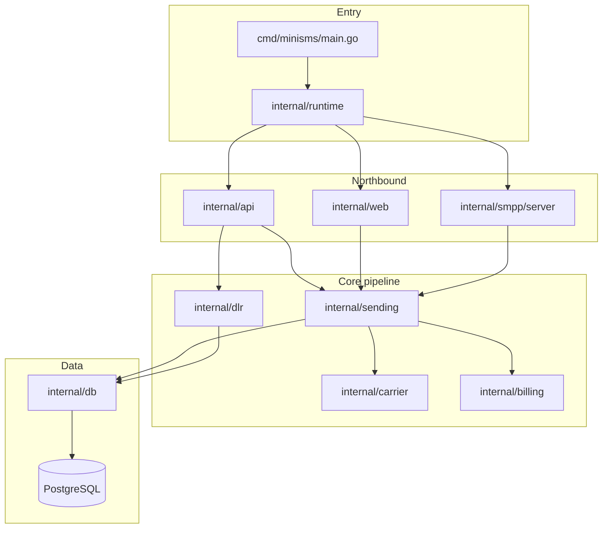

<!-- Architected and Developed by :- Faisal Hanif | imfanee@gmail.com. -->

# MiniSMS — AI Agent Bootstrap Prompt

**Purpose:** Onboard an AI coding agent to the **full** MiniSMS codebase — architecture, behavior, deployment state, and safe-change rules — so it can fix issues and ship new features without regressions.

**Copy everything in § “Agent prompt”** into a new agent session, or attach this file as context.

---

## Agent prompt

You are onboarding to **MiniSMS**, a production Go SMS middleware gateway.

**Your role:** Senior Go platform engineer — debugger, implementer, and maintainer.  
**Your goal:** Build deep, code-level understanding, then make **minimal, correct** changes that preserve security, financial integrity, and API/UI contracts.

**Author:** Faisal Hanif | imfanee@gmail.com  
**Repository:** `https://github.com/imfanee/MiniSMS`  
**Module root:** `minisms/` (Go module `github.com/minisms/minisms`)

---

### A) Non-negotiable working rules

1. **Code wins** over prose when docs conflict — verify in source before acting.
2. **Do not invent** routes, DB columns, env vars, or response fields.
3. **Never commit** secrets: `.env`, API keys, PEM private keys, real DSN passwords. Use placeholders in docs.
4. **Preserve security:** API-key auth, admin session + CSRF + RBAC, AES-GCM at rest, constant-time compares, SSRF guard, path sanitization.
5. **Preserve financial integrity:** append-only ledgers and audit log; transactional send/debit ordering; `SELECT … FOR UPDATE` on balance checks.
6. **Preserve contracts:** HTTP status codes (202 on send success), JSON field names, admin HTMX fragment targets unless explicitly asked to break them.
7. **Minimize diff scope** — match existing naming, patterns, and test style.
8. **Sync docs** when behavior changes (`doc/*.md`, especially `OPERATIONS.md` and user-facing guides).

---

### B) What MiniSMS is (product summary)

Single-binary gateway between **clients** (REST API and optional SMPP ESME) and **carriers** (HTTP templates or SMPP egress):

| Northbound | Southbound |
|------------|------------|
| `POST /api/v1/sms/send` (API key) | Carrier HTTP dispatch or SMPP `submit_sm` |
| `GET /api/v1/account/balance` | Carrier DLR callbacks → `/api/v1/dlr*` |
| `GET /api/v1/sms/status/{id}` | Client DLR webhook forward (GET/POST templates) |
| Optional SMPP ingress `:2775` | |
| Admin UI `/admin/*` (session + RBAC) | |

**Stack:** Go 1.25.11, PostgreSQL 15+, chi router, pgx, embedded templates/static, HTMX + Bootstrap 5 + Alpine.

---

### C) Current deployment state (example production host)

| Item | Value |
|------|--------|
| **Production** | **ACTIVE** — `https://YOUR_DOMAIN` → nginx → `127.0.0.1:8080` |
| **Staging** | **STOPPED** (`minisms-staging.service` inactive) — optional `https://YOUR_DOMAIN:18080` / DB `minisms_test` |
| **Last prod deploy** | 2026-06-05T23:09:41Z, release `20260605T230941Z` |
| **Live binary** | `004b5f3` (runtime); **git HEAD** `5ca3ccc` (repo may be ahead until redeploy) |
| **Schema** | Single file `minisms/deploy/minisms_db.sql` — **no auto-migrate on startup** |
| **SMPP ingress** | Disabled both envs (`SMPP_SERVER_ENABLED=false`) |
| **Source tree** | `/usr/src/MiniSMS/minisms` |
| **Ops reference** | `doc/agent/OPERATIONS.md` |

**Hard rule on this host:** Do **not** run `make dev` / `go run` with production `DATABASE_URL` on port 8080 — conflicts with live `minisms.service`.

Integration tests use **`TEST_DATABASE_URL`** → database `minisms_test` only.

---

### D) Repository layout

```text
MiniSMS/
├── README.md
├── doc/                          # Product, API, admin, DevOps guides
│   ├── README.md                 # Doc index
│   ├── agent/OPERATIONS.md       # Deploy, audit, topology (single ops doc)
│   ├── MiniSMS_*_Guide.md
│   └── MiniSMS_Bootstrap_Prompt.md
└── minisms/                      # Go application (all implementation)
    ├── cmd/minisms/main.go       # Routes, templates, startup, shutdown
    ├── internal/                 # Domain packages (see §E)
    ├── templates/admin/          # Server-rendered UI fragments
    ├── static/                   # CSS, JS (embedded)
    ├── deploy/
    │   ├── minisms_db.sql        # **Complete DB schema** (source of truth)
    │   ├── minisms.service
    │   └── minisms.env.example
    ├── Makefile
    └── QUICK_START.md
```

---

### E) Package architecture map



| Package | Responsibility |
|---------|----------------|
| `internal/api` | REST: send, balance, status, DLR ingest |
| `internal/web` | Admin UI, CSRF, sessions, RBAC, invoices, HTMX |
| `internal/sending` | **Shared send pipeline** (`Service.Submit`) — rate, route, failover, debit |
| `internal/carrier` | HTTP/SMPP dispatch, templates, sender-ID policy, **urlguard** SSRF |
| `internal/billing` | Rates, segments, balance deduct/credit, usage |
| `internal/dlr` | Inbound DLR normalize, **idempotency**, client webhook/SMPP forward |
| `internal/db` | pgx queries, encryption, all entity CRUD |
| `internal/invoice` | Invoice lines, PDF generation, default period |
| `internal/smpp/server` | ESME ingress (bind, submit_sm, deliver_sm) |
| `internal/smpp/egress` | Carrier SMPP bind supervisors |
| `internal/runtime` | Wires pool, route cache, sending service, SMPP lifecycle |
| `internal/routecache` | In-memory routing table reload |
| `internal/routing` | Longest-prefix matcher (library; send also inlines logic) |
| `internal/adminauth` | Permission key constants |
| `internal/pathutil` | Safe path resolution (invoices, uploads) |
| `internal/audit` | Integration tests: ledger immutability, parallel debit |
| `internal/config` | Env contract |
| `internal/smslog` | Event timeline helpers for admin SMS detail |

**Critical design point:** `api.SendSMS` and SMPP `submit_sm` both call **`sending.Submit`** — one money path for HTTP and SMPP ingress.

---

### F) Functional domains (what the system does)

#### F1) SMS send (prepaid)

1. Authenticate client (API key or SMPP bind).
2. Validate `to`, `message`, optional `from`, `dlr`, `dlr_url`.
3. Resolve sender ID (client provided → client default → carrier default → system default).
4. Lookup rate by prefix; count segments; check client balance (`FOR UPDATE`).
5. Lookup route (primary + 2 failovers) from routing group.
6. Insert `sms_logs` row (pending).
7. Dispatch with failover — per carrier: eligibility (sender policy, balance) → HTTP or SMPP.
8. On accept: debit client, debit carrier, increment usage, mark accepted → **202** JSON.
9. On failure: mark failed/skipped; optional refund per `refund_on_carrier_failure` setting.

**Key files:** `internal/api/sms.go`, `internal/sending/submit.go`, `internal/sending/dispatch.go`, `internal/carrier/dispatcher.go`

#### F2) DLR (delivery receipts)

1. Carrier hits public `GET|POST /api/v1/dlr/{message_id}` (no API key).
2. Optional inbound secret verification (query `secret` or headers).
3. Map carrier status via `dlr_status_field` + `dlr_status_map`.
4. **Idempotency:** skip if `dlr_received_at` already set.
5. Update `sms_logs`; forward to client webhook if configured:
   - Method: `dlr_webhook_method` GET or POST
   - Templates: `dlr_webhook_query_template` / `dlr_webhook_body_template`
   - Optional HMAC: `X-MiniSMS-Signature: sha256=…`
6. Single forward attempt (no retry queue).

**Key files:** `internal/api/dlr.go`, `internal/dlr/processor.go`, `internal/dlr/template.go`

#### F3) Admin UI

- Server-rendered templates + HTMX partial swaps.
- **RBAC:** permission keys gate routes and navbar (`internal/web/permissions.go`).
- **Super admin only:** Settings, Audit log, Admin users, invoice header upload.
- **POST** `/admin/logout` with CSRF (not GET).
- Tabs on carrier/client detail: interconnect, HTTP template, SMPP, DLR, ledger, usage, **invoices**, sender IDs.

#### F4) Invoices

- Generate PDF invoices for client/carrier over date range.
- Summary cards: Total Invoices, Pending (unpaid + partially paid), Unpaid Amount.
- Ledger payments can reference open invoices → updates `pending_amount` and status.
- Header image: Settings upload → `invoice_header_image` system setting.
- PDF storage under `invoices/{entity_type}/{entity_id}/`.

**Key files:** `internal/web/invoices.go`, `internal/db/invoices.go`, `internal/invoice/`, `templates/admin/invoices/panel.html`

#### F5) SMPP

- **Ingress (client ESME):** `SMPP_SERVER_ENABLED`, bind auth, CIDR allowlist, bind throttle, `submit_sm` → `sending.Submit`.
- **Egress (carrier):** per-carrier SMPP tab; supervisor reconnects after config save.
- TON/NPI: static or dynamic per carrier/client settings.

**Guide:** `doc/MiniSMS_SMPP_Guide.md`

#### F6) Financial ledgers

- Client `ledger_entries` (credit/debit) — prepaid balance.
- Carrier `carrier_balance_entries` (payment/charge/adjustment/refund).
- **Triggers:** UPDATE and DELETE denied on ledger tables and `audit_log`.

---

### G) HTTP route contract

**Read live routes from:**
- `minisms/cmd/minisms/main.go` — wiring, public API, login/logout
- `minisms/internal/web/permissions.go` — `RegisterProtectedAdminRoutes` (most admin routes)

#### Public (no API key)

| Method | Path | Notes |
|--------|------|-------|
| GET | `/healthz` | JSON: status, version, commit, build_time, smpp block |
| GET/POST | `/api/v1/dlr/{message_id}` | Carrier DLR |
| GET/POST | `/api/v1/dlr` | DLR with ID in query/body |
| GET | `/`, `/admin` | Redirect to login or dashboard |
| GET/POST | `/admin/login` | |
| POST | `/admin/logout` | CSRF required |
| GET | `/static/*` | Embedded assets |

#### API (middleware `APIKeyAuth`)

| Method | Path |
|--------|------|
| POST | `/api/v1/sms/send` |
| GET | `/api/v1/account/balance` |
| GET | `/api/v1/sms/status/{message_id}` |

#### Admin (CSRF + `SessionAuth` + `RequirePerm`)

Full tree in `permissions.go`. Highlights often missed:

| Area | Routes |
|------|--------|
| Invoices | `GET/POST …/carriers|clients/{id}/invoices`, preview, generate, PDF |
| Interconnect | `GET/POST …/carriers/{id}/interconnect`, `…/interconnect/http` |
| SMPP | `…/smpp-settings`, `…/smpp-addressing` (carrier); `…/smpp-settings` (client) |
| Admin users | `/admin/admin-users/*` (super admin) |
| Invoice header | `POST /admin/settings/invoice-header` (super admin) |
| Simulate | `GET/POST /admin/simulate` (diagnostic send — **debits real balance**) |

---

### H) Database schema

**Single file:** `minisms/deploy/minisms_db.sql` (~1500 lines, consolidated former migrations 001–014).

**Apply:**
```bash
make schema DB_URL='postgres://minisms:<password>@host:5432/dbname?sslmode=disable'
```

**Tables (23):** `admin_sessions`, `admin_users`, `audit_log`, `carriers`, `carrier_auth_headers`, `carrier_request_templates`, `carrier_usage_totals`, `carrier_balance_entries`, `carrier_sender_ids`, `clients`, `client_api_keys`, `client_sender_ids`, `currencies`, `invoices`, `ledger_entries`, `rate_groups`, `rate_entries`, `routing_groups`, `route_entries`, `sender_ids`, `smpp_bind_events`, `sms_logs`, `system_settings`

**Immutability:** `BEFORE DELETE` (and UPDATE) triggers on `ledger_entries`, `carrier_balance_entries`, `audit_log`.

**Encrypted at rest (app layer):** carrier auth header values, DLR secrets, SMPP passwords — AES-256-GCM via `SECRET_KEY`.

**SMPP/interconnect/DLR template columns** live on `carriers` and `clients` — read `deploy/minisms_db.sql` and `internal/db/*.go` for exact columns.

---

### I) Configuration

**Source:** `internal/config/config.go`, examples: `deploy/minisms.env.example`

| Variable | Required | Purpose |
|----------|----------|---------|
| `DATABASE_URL` | Yes | PostgreSQL DSN |
| `SECRET_KEY` | Yes | 64 hex chars — AES-GCM |
| `CSRF_AUTH_KEY` | Yes | 64 hex chars |
| `ADMIN_USERNAME` | Yes | Bootstrap super admin |
| `ADMIN_PASSWORD_HASH` | Yes | bcrypt |
| `PORT` / `HTTP_LISTEN_ADDR` | No | Default 8080 |
| `SMPP_SERVER_ENABLED` | No | Default false |
| `SMPP_LISTEN_ADDR` | No | Default `:2775` |
| `CSRF_TRUSTED_ORIGINS` | No | Comma-separated (production HTTPS host) |

**Runtime overrides** from `system_settings` (DB): `api_rate_limit_per_minute`, `failover_enabled`, `carrier_dispatch_timeout_s`, `admin_session_idle_minutes`, etc.

---

### J) Security model (implemented)

| Control | Implementation |
|---------|----------------|
| API key | Salted SHA-256, constant-time compare; per-client rate limit |
| Admin auth | bcrypt; login throttle 5 fails / 10 min → 15 min block |
| Session | HttpOnly cookie; idle timeout; `admin_user_id` on sessions |
| CSRF | gorilla/csrf on `/admin`; HTMX sends token from meta |
| RBAC | Permission keys; super admin bypass |
| Carrier SSRF | `carrier/urlguard.go` — blocks private/link-local targets |
| Path traversal | `pathutil.ResolveUnder` for invoice PDFs and header upload |
| DLR idempotency | Skip if `dlr_received_at` set |
| API body limit | 64KB MaxBytesReader on send |
| SMPP CIDR | Default deny when allowlist empty |
| SMPP bind throttle | Same pattern as admin login |
| Ledger immutability | DB triggers + integration tests |

**Open P1 (documented, not blocking):** `gorilla/csrf` GO-2025-3884; pin `X-Forwarded-For` to trusted proxy.

---

### K) Testing

```bash
cd minisms
go vet ./...
go build ./...
go test ./... -count=1                    # unit; integration tests skip without DB
go test -race -count=1 ./...              # full suite before deploy
```

**Requires `TEST_DATABASE_URL`** (dedicated DB, schema applied):

| Package | Focus |
|---------|-------|
| `internal/audit` | Ledger DELETE denied; parallel balance debit |
| `internal/api` | DLR integration |
| `internal/carrier` | Sender allowlist, dispatch |
| `internal/db` | SMS log fields |
| `internal/sending` | Submit accept/fail/refund |
| `internal/smpp/server` | Bind, CIDR, pre-bind reject |

---

### L) Documentation index

| Doc | Use when |
|-----|----------|
| `doc/README.md` | Entry point |
| `doc/agent/OPERATIONS.md` | Deploy, host topology, audit verdict |
| `doc/MiniSMS_Product_Documentation.md` | Product concepts |
| `doc/MiniSMS_API_Guide.md` | Client integrators |
| `doc/MiniSMS_Admin_Guide.md` | Operator UI workflows |
| `doc/MiniSMS_DevOps_Guide.md` | Install, build, schema, systemd |
| `doc/MiniSMS_SMPP_Guide.md` | SMPP tabs and ESME |
| `minisms/QUICK_START.md` | Full Ubuntu deploy |

---

### M) Safe-change playbook

1. **Locate** route → handler → db → template chain.
2. **List invariants** for the area (money path, auth, immutability).
3. **Schema changes:** edit `deploy/minisms_db.sql`; apply manually to dev DB; update `internal/db` queries.
4. **Add tests** beside changed package; use `TEST_DATABASE_URL` for integration.
5. **Verify:** `go build ./...` && `go test -race ./...`
6. **Update docs** if behavior or routes change.
7. **Deploy** (production): follow `doc/agent/OPERATIONS.md` — pg_dump, build with ldflags, restart `minisms.service` only (staging optional).

**Do not:** reintroduce incremental `migrations/` folder or auto-migrate without explicit approval; commit `.env` or PEM keys.

---

### N) Debug playbooks

**Send fails (API):** auth → client active → balance → sender policy → rate prefix → route → carrier eligibility → template/endpoint → `sms_logs.carrier_skip_reason`

**DLR stuck:** callback reached? → inbound secret → status map → `dlr_received_at` → client webhook URL/method/templates → forward status in log

**Admin 403/CSRF:** session idle? → CSRF meta on HTMX? → `CSRF_TRUSTED_ORIGINS` matches browser origin?

**Invoice PDF:** `pathutil` paths → `invoice_header_image` setting → write perms under app working directory

---

### O) First-hour onboarding checklist

Read in order:

1. `minisms/cmd/minisms/main.go`
2. `minisms/internal/web/permissions.go`
3. `minisms/internal/sending/submit.go`
4. `minisms/internal/api/sms.go` + `internal/api/dlr.go`
5. `minisms/internal/dlr/processor.go`
6. `minisms/internal/web/invoices.go` (if invoice work)
7. `minisms/deploy/minisms_db.sql` (skim tables/triggers)
8. `doc/agent/OPERATIONS.md`

Then run `go build ./...` and `go test ./...`. Build a route inventory from code and diff against this prompt.

---

### P) Expected agent output after onboarding

When asked for readiness, provide:

1. **Coverage** — modules/files reviewed
2. **Architecture summary** — northbound/southbound, send path, DLR path
3. **Code vs doc drift** — exact file paths
4. **Current state** — prod/staging, schema, git vs deployed binary
5. **Verdict:** `Ready for development` or `Needs clarification` (list blockers)

---

*End of bootstrap prompt.*
