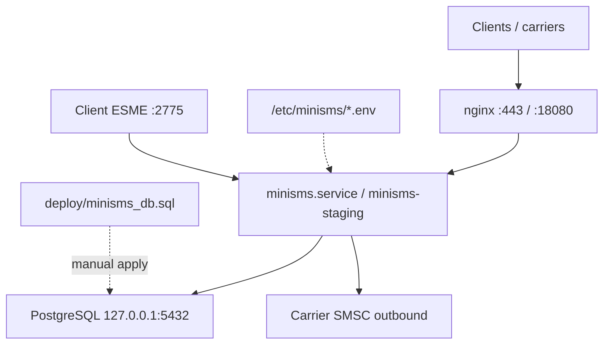

<!-- Architected and Developed by :- Faisal Hanif | imfanee@gmail.com. -->

# MiniSMS — Operations, Architecture & Audit

**Single reference** for this deployment host. Replaces provisional agent runbooks, phase notes, and audit reports (merged 2026-06-05).

**Source of truth:** `/usr/src/MiniSMS/minisms/`  
**Doc index:** [../README.md](../README.md)

---

## 1. Deployment status

| Item | Value |
|------|--------|
| **Last deploy** | 2026-06-18 (direct Airtel SMPP interconnect + N parallel binds; carrier DLR over `deliver_sm`) |
| **Environments** | Production **active**; staging **stopped** (2026-06-06) |
| **Git commit** | deployed binary built from local working tree (multi-bind SMPP egress + `smpp_bind_count` UI); commit when landed on `main` |
| **Binary** | `/usr/local/bin/minisms` (built from `/usr/src/MiniSMS/minisms`, installed by hand) |
| **Schema** | **Live DB is authoritative.** `deploy/minisms_db.sql` is a fresh-install/hybrid file and is NOT applied to the populated prod DB; upgrades apply only additive deltas after a restored-copy rehearsal. |
| **/opt/minisms** | Data-only working dir (`assets/`, `invoices/`); contains no source code or `releases/` as of this deploy. |

| Check | Production | Staging |
|-------|------------|---------|
| URL | `https://YOUR_DOMAIN` | `https://YOUR_DOMAIN:18080` (staging stopped) |
| Service | `minisms.service` **active** | `minisms-staging.service` **inactive** |
| Database | `minisms` | `minisms_test` |
| App bind | `127.0.0.1:8080` | `127.0.0.1:18081` |
| SMPP ingress | **enabled** on `127.0.0.1:2775` (localhost-only; widen + firewall for real clients) | disabled |

**Credentials:** Never commit `/etc/minisms/*.env`, API keys, or database passwords. Docs use placeholders only.

---

## 2. Topology



| Path | Role |
|------|------|
| `/usr/local/bin/minisms` | Production binary (systemd ExecStart) |
| `/opt/minisms/bin/minisms` | Production copy |
| `/opt/minisms/bin/minisms-staging` | Staging binary |
| `/opt/minisms-staging/` | Staging working directory |
| `/etc/minisms/minisms.env` | Production config (mode 600) |
| `/etc/minisms/minisms-staging.env` | Staging overrides |
| `/usr/src/MiniSMS/minisms/` | Build source |

---

## 3. Architecture (summary)

| Package | Responsibility |
|---------|----------------|
| `cmd/minisms` | Config, pool, routes, graceful shutdown |
| `internal/api` | REST: send, balance, status, DLR |
| `internal/web` | Admin UI, sessions, CSRF, RBAC |
| `internal/carrier` | HTTP/SMPP dispatch, SSRF guard, templates |
| `internal/billing` | Rates, segments, ledger |
| `internal/db` | pgx, encryption, invoices |
| `internal/smpp/server` | Optional ESME ingress |
| `internal/smpp/egress` | Carrier SMPP binds |

**Public routes:** `/healthz`, `/api/v1/dlr*`, `/static/*`  
**API (key auth):** `POST /api/v1/sms/send`, `GET /api/v1/account/balance`, `GET /api/v1/sms/status/{id}`  
**Admin:** `/admin/*` with CSRF + session; super-admin: Settings, Audit log, Admin users  
**Logout:** `POST /admin/logout` with CSRF

**Required env:** `DATABASE_URL`, `SECRET_KEY`, `CSRF_AUTH_KEY`, `ADMIN_USERNAME`, `ADMIN_PASSWORD_HASH`

---

## 4. Database schema

Schema lives in one file: **`minisms/deploy/minisms_db.sql`** (consolidated from former migrations 001–014).

### Fresh database

```bash
cd /usr/src/MiniSMS/minisms
createdb -O minisms minisms          # or minisms_test for staging
make schema DB_URL='postgres://minisms:<password>@127.0.0.1:5432/minisms?sslmode=disable'
```

### Upgrading an existing database

The app **does not** auto-apply schema on startup. For schema changes:

1. Diff `deploy/minisms_db.sql` against your live DB (or use `pg_dump --schema-only`).
2. Apply only the missing `ALTER` / `CREATE IF NOT EXISTS` sections manually, or restore to a fresh DB from dump + full schema on a maintenance window.

### Schema highlights

- Append-only ledgers and audit log (`BEFORE DELETE` triggers)
- `admin_users` + RBAC; `invoices` table + `invoice_number_seq`
- Client DLR webhook method/templates (`dlr_webhook_method`, query/body templates)
- SMPP carrier/client settings (migration-era columns consolidated)

---

## 5. Deploy runbook

Model as of 2026-06-17: single binary at `/usr/local/bin/minisms`; `/opt/minisms` is data-only (`assets/`, `invoices/`); no `releases/` or `/opt/minisms/bin`. Staging service is stopped.

### Preconditions

- `go vet ./...` and `go test ./...` green (from `minisms/`)
- Explicit deploy approval
- If the code expects new columns/objects: diff the LIVE DB against a scratch DB built from `deploy/minisms_db.sql`, and apply only additive deltas (see §4). Do NOT apply the whole schema file to the populated prod DB.

### Standard deploy (production)

```bash
TS=$(date -u +%Y%m%dT%H%M%SZ)
BK="/root/minisms-upgrade-backup-${TS}"; mkdir -p "$BK"
# Load DATABASE_URL literally (bcrypt hash etc. contain $, so never `set -a; . env`)
DATABASE_URL=$(grep '^DATABASE_URL=' /etc/minisms/minisms.env | cut -d= -f2- | sed -E "s/^['\"]//; s/['\"]$//")

# 1) Backups
pg_dump -Fc -f "$BK/minisms_db.dump" "$DATABASE_URL"
cp -a /usr/local/bin/minisms "$BK/minisms.binary.bak"
tar -C /opt -czf "$BK/opt_minisms_folder.tgz" minisms

# 2) Build
cd /usr/src/MiniSMS/minisms && go build -o /tmp/minisms_new ./cmd/minisms

# 3) (Recommended) Rehearse on a restored copy before touching live:
#    createdb ms_rehearsal; pg_restore -d ms_rehearsal "$BK/minisms_db.dump"
#    run /tmp/minisms_new with DATABASE_URL=...ms_rehearsal PORT=19099 TLS_ENABLED=false → expect /healthz 200

# 4) Cutover with health check + auto-rollback
cp -a /usr/local/bin/minisms "/usr/local/bin/minisms.pre-upgrade-${TS}"
systemctl stop minisms
install -m 0755 /tmp/minisms_new /usr/local/bin/minisms
systemctl start minisms
code=$(curl -s --retry 30 --retry-delay 1 --retry-connrefused -o /dev/null -w '%{http_code}' http://127.0.0.1:8080/healthz)
if [ "$code" != 200 ]; then
  systemctl stop minisms
  install -m 0755 "/usr/local/bin/minisms.pre-upgrade-${TS}" /usr/local/bin/minisms
  systemctl start minisms
  echo "ROLLED BACK"; fi
```

> Health-check the DIRECT app port `http://127.0.0.1:8080/healthz` (what nginx proxies to), not `https` via nginx; a transient nginx probe can false-negative and trigger an unnecessary rollback.

### Rollback (binary)

```bash
systemctl stop minisms
install -m 0755 /usr/local/bin/minisms.pre-upgrade-<TS> /usr/local/bin/minisms   # or $BK/minisms.binary.bak
systemctl start minisms
curl -s -o /dev/null -w '%{http_code}\n' http://127.0.0.1:8080/healthz
# DB rollback if ever needed: pg_restore from $BK/minisms_db.dump
```

### SMPP network

- HTTP/API/DLR: nginx → `:8080`
- Client ESME: TCP `:2775` (not behind nginx); firewall to trusted IPs
- SMPP ingress is currently **enabled** but bound to `127.0.0.1:2775` (`SMPP_SERVER_ENABLED=true`, `SMPP_LISTEN_ADDR=127.0.0.1:2775` in the env). This is safe (no public exposure) and was used to validate the client-ingress path end-to-end (bind, `submit_sm` to Airtel, `deliver_sm` DLR back) with `minisms/scripts/smpp_ingress_demo.py`. To onboard a real remote client, change `SMPP_LISTEN_ADDR` to a reachable interface, firewall `:2775` to the client's IPs, and set the client's `smpp_allowed_cidrs`. A localhost-only `SMPP Ingress Test` client (system_id `ingresstest`) exists for testing; remove or rotate it before exposing the port.

### Carrier SMPP egress: Airtel DRC direct interconnect (2026-06-18)

- DRC Airtel traffic now goes over a **direct outbound SMPP** carrier (`Airtel DRC Direct (SMPP)`, `egress_transport=smpp`) to the Airtel DRC SMSC, replacing the previous path through the Kamex (Kannel) HTTP `sendsms` gateway.
- The carrier runs **8 parallel transceiver binds** (`smpp_bind_count=8`, `smpp_throughput_per_s=1` per bind so aggregate ~8/s, matching the prior Kamex setup). The egress manager opens one `sessionGroup` of N binds per carrier and round-robins `submit_sm`; delivery receipts (`deliver_sm`) arriving on any bind are correlated carrier-wide by `carrier_message_id`. Bind count is editable in the admin carrier SMPP panel and rebinds within about 60 seconds.
- The Kamex gateway host (`jasmin-gw`) has its Kannel stack **stopped and disabled** so MiniSMS is the sole ESME on the Airtel system_id and receives all DLRs. Roll back by re-enabling the Kamex units and repointing the DRC route_entries to the old HTTP carrier (`IZZI DRC Airtel`). Topology details (host, ids, credentials handling) live in the agent project memory `minisms-airtel-smpp`, not in this repo.
- Schema delta for this change: `carriers.smpp_bind_count INT NOT NULL DEFAULT 1` with `CHECK (1..16)` (already in `deploy/minisms_db.sql`; applied to the live DB additively).

---

## 6. Dev & test workflow

**Hard rule:** Do not point dev/test at production `minisms` on this host.

```bash
cd /usr/src/MiniSMS/minisms
go vet ./...
go test -race ./... -count=1
```

Integration tests require `TEST_DATABASE_URL` pointing at `minisms_test` with schema applied:

```bash
export TEST_DATABASE_URL='postgres://minisms:<password>@127.0.0.1:5432/minisms_test?sslmode=disable'
make schema DB_URL="$TEST_DATABASE_URL"   # first time or after schema change
go test -race ./... -count=1
```

**Never on this host without staging DSN + non-conflict port:** `make dev`, `make run`, `go run ./cmd/minisms` with production `.env`.

| Database | Purpose |
|----------|---------|
| `minisms` | Production only |
| `minisms_test` | Staging + CI integration tests |

---

## 7. Security & audit (2026-06-05)

### Verdict: **GO**

| Layer | Status |
|-------|--------|
| `go test -race ./...` | **PASS** |
| Go 1.25.11 | **PASS** |
| Production + staging runtime | **PASS** |
| Ledger immutability | **PASS** (DELETE triggers) |

### Fixed (deployed)

| Item | Mitigation |
|------|------------|
| Carrier dispatch SSRF | `carrier/urlguard.go` (`ValidateEndpointURL`) |
| DLR client-webhook SSRF (2026-06-17) | `ValidateEndpointURL` on forward URL; blocked forwards recorded `blocked` |
| Carrier query `+`/`&`/`=` corruption (2026-06-17) | `carrier.InjectQueryVariables` URL-encodes each query value (`+` → `%2B`, not a space) |
| DLR multi-bit `dlr-mask` (2026-06-17) | `db.UpdateDLRReceived` applies only while non-final; an intermediate (SMSC ACK/queued) never blocks or overwrites the final |
| Invoice/path traversal | `pathutil.ResolveUnder` |
| API body DoS | 64KB `MaxBytesReader` on send |
| GET logout CSRF | `POST /admin/logout` |
| SMPP CIDR | Default deny when allowlist empty |
| Invoice header upload | Magic-byte validation |
| Dashboard template | `lt .Margin 0.0` |

### Open (P1 / accepted)

| Item | Notes |
|------|-------|
| `gorilla/csrf` GO-2025-3884 | Restrict `CSRF_TRUSTED_ORIGINS` |
| XFF without proxy pin | Trust only nginx hop |
| In-memory rate limits | Per-process; multi-instance caveat |
| Diagnostic send debits | Operational policy (`PermSimulate`) |
| DLR logs webhook URL on failure | May leak query secrets |

### Verification commands

```bash
cd /usr/src/MiniSMS/minisms
go build ./... && go vet ./...
go test -race -count=1 ./...
govulncheck ./...
curl -sS http://127.0.0.1:8080/healthz
curl -skS https://127.0.0.1:18080/healthz
```

---

## 8. SMPP operations

- **Ingress:** Client ESME binds; `SMPP_SERVER_ENABLED`, CIDR allowlist, bind throttle
- **Egress:** Per-carrier SMPP tab; supervisor reconnects ~60s after save
- **Admin tabs:** Carrier **SMPP Egress**; Client **SMPP Ingress**
- **DLR delivery mode:** `dlr_delivery_mode` on client SMPP settings

See [MiniSMS_SMPP_Guide.md](../MiniSMS_SMPP_Guide.md) for operator UI steps.

---

## 9. Known doc/code gaps

| Topic | Notes |
|-------|-------|
| Deploy path | Live cwd `/opt/minisms`; source `/usr/src/MiniSMS/minisms` |
| `dlr_field_name` on carriers | Stored; not used in DLR ingest |
| `routing/matcher.go` | Send path duplicates longest-prefix logic inline |
| DB role GRANT | Commented in `deploy/minisms_db.sql` — optional hardening |

---

## 10. Post-deploy smoke

- [ ] `/healthz` ok on prod and staging
- [ ] Admin login on both URLs
- [ ] Client/carrier **Invoices** tab — summary cards visible
- [ ] Optional: test SMS via API on staging
