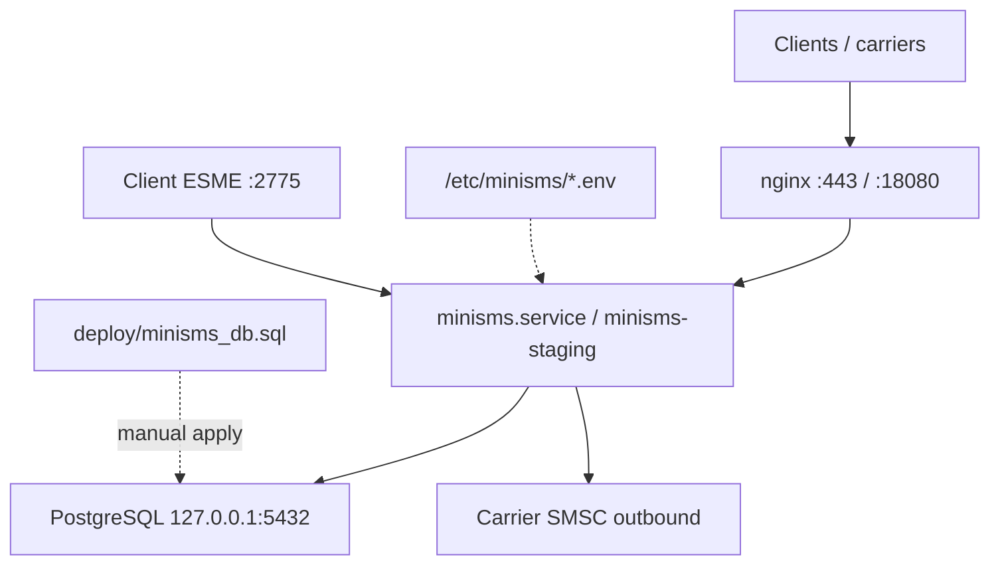

<!-- Architected and Developed by :- Faisal Hanif | imfanee@gmail.com. -->

# MiniSMS — Operations, Architecture & Audit

**Single reference** for this deployment host. Replaces provisional agent runbooks, phase notes, and audit reports (merged 2026-06-05).

**Source of truth:** `/usr/src/MiniSMS/minisms/`  
**Doc index:** [../README.md](../README.md)

---

## 1. Deployment status

| Item | Value |
|------|--------|
| **Last deploy** | 2026-06-05T23:09:41Z (`20260605T230941Z`) |
| **Environments** | Production + staging (same binary) |
| **Git commit** | `004b5f3` |
| **Schema** | `deploy/minisms_db.sql` (consolidated; replaces migrations 001–014) |
| **Release dir** | `/opt/minisms/releases/20260605T230941Z/` |

| Check | Production | Staging |
|-------|------------|---------|
| URL | `https://sms.telecotech.net` | `https://sms.telecotech.net:18080` |
| Service | `minisms.service` | `minisms-staging.service` |
| Database | `minisms` | `minisms_test` |
| App bind | `127.0.0.1:8080` | `127.0.0.1:18081` |
| SMPP ingress | disabled | disabled |

**Credentials:** Never commit `/etc/minisms/*.env`, API keys, or database passwords. Docs use placeholders only.

---

## 2. Topology



| Path | Role |
|------|------|
| `/usr/local/bin/minisms` | Production binary (systemd ExecStart) |
| `/opt/minisms/bin/minisms` | Production copy |
| `/opt/minisms/bin/minisms-staging` | Staging binary |
| `/opt/minisms-staging/` | Staging working directory |
| `/etc/minisms/minisms.env` | Production config (mode 600) |
| `/etc/minisms/minisms-staging.env` | Staging overrides |
| `/usr/src/MiniSMS/minisms/` | Build source |

---

## 3. Architecture (summary)

| Package | Responsibility |
|---------|----------------|
| `cmd/minisms` | Config, pool, routes, graceful shutdown |
| `internal/api` | REST: send, balance, status, DLR |
| `internal/web` | Admin UI, sessions, CSRF, RBAC |
| `internal/carrier` | HTTP/SMPP dispatch, SSRF guard, templates |
| `internal/billing` | Rates, segments, ledger |
| `internal/db` | pgx, encryption, invoices |
| `internal/smpp/server` | Optional ESME ingress |
| `internal/smpp/egress` | Carrier SMPP binds |

**Public routes:** `/healthz`, `/api/v1/dlr*`, `/static/*`  
**API (key auth):** `POST /api/v1/sms/send`, `GET /api/v1/account/balance`, `GET /api/v1/sms/status/{id}`  
**Admin:** `/admin/*` with CSRF + session; super-admin: Settings, Audit log, Admin users  
**Logout:** `POST /admin/logout` with CSRF

**Required env:** `DATABASE_URL`, `SECRET_KEY`, `CSRF_AUTH_KEY`, `ADMIN_USERNAME`, `ADMIN_PASSWORD_HASH`

---

## 4. Database schema

Schema lives in one file: **`minisms/deploy/minisms_db.sql`** (consolidated from former migrations 001–014).

### Fresh database

```bash
cd /usr/src/MiniSMS/minisms
createdb -O minisms minisms          # or minisms_test for staging
make schema DB_URL='postgres://minisms:<password>@127.0.0.1:5432/minisms?sslmode=disable'
```

### Upgrading an existing database

The app **does not** auto-apply schema on startup. For schema changes:

1. Diff `deploy/minisms_db.sql` against your live DB (or use `pg_dump --schema-only`).
2. Apply only the missing `ALTER` / `CREATE IF NOT EXISTS` sections manually, or restore to a fresh DB from dump + full schema on a maintenance window.

### Schema highlights

- Append-only ledgers and audit log (`BEFORE DELETE` triggers)
- `admin_users` + RBAC; `invoices` table + `invoice_number_seq`
- Client DLR webhook method/templates (`dlr_webhook_method`, query/body templates)
- SMPP carrier/client settings (migration-era columns consolidated)

---

## 5. Deploy runbook

### Preconditions

- `go vet ./...` and `go test -race ./...` green
- Explicit deploy approval
- Schema already applied on target DB (or run `make schema` before first start)

### Standard deploy (production + staging)

```bash
TS=$(date -u +%Y%m%dT%H%M%SZ)
REL="/opt/minisms/releases/${TS}"
mkdir -p "$REL"
DATABASE_URL=$(grep '^DATABASE_URL=' /etc/minisms/minisms.env | cut -d= -f2-)

pg_dump -Fc -f "$REL/minisms_${TS}.dump" "$DATABASE_URL"
cp -a /usr/local/bin/minisms "$REL/minisms.bin.prev"
cp -a /opt/minisms/bin/minisms "$REL/minisms.opt.prev"
cp -a /opt/minisms/bin/minisms-staging "$REL/minisms-staging.prev"
cp -a /etc/minisms/minisms.env "$REL/minisms.env.prev"

cd /usr/src/MiniSMS/minisms
COMMIT=$(git rev-parse --short HEAD)
BUILD_TIME=$(date -u +%Y-%m-%dT%H:%M:%SZ)
CGO_ENABLED=0 go build -trimpath \
  -ldflags="-s -w -X main.version=${COMMIT} -X main.commit=${COMMIT} -X main.buildTime=${BUILD_TIME}" \
  -o "$REL/minisms.new" ./cmd/minisms

install -m 0755 "$REL/minisms.new" /usr/local/bin/minisms
install -m 0755 -o minisms -g minisms "$REL/minisms.new" /opt/minisms/bin/minisms
install -m 0755 -o minisms -g minisms "$REL/minisms.new" /opt/minisms/bin/minisms-staging

systemctl restart minisms.service minisms-staging.service
sleep 3
curl -sS http://127.0.0.1:8080/healthz
curl -skS https://127.0.0.1:18080/healthz
```

> Do not `source /etc/minisms/minisms.env` with `set -u` — bcrypt hash may contain `$`.

### Rollback (binary only)

```bash
REL=/opt/minisms/releases/20260605T230941Z
install -m 0755 "$REL/minisms.bin.prev" /usr/local/bin/minisms
install -m 0755 -o minisms -g minisms "$REL/minisms.opt.prev" /opt/minisms/bin/minisms
install -m 0755 -o minisms -g minisms "$REL/minisms-staging.prev" /opt/minisms/bin/minisms-staging
systemctl restart minisms.service minisms-staging.service
```

### SMPP network

- HTTP/API/DLR: nginx → `:8080`
- Client ESME: TCP `:2775` (not behind nginx); firewall to trusted IPs
- Start with `SMPP_SERVER_ENABLED=false` until clients ready

---

## 6. Dev & test workflow

**Hard rule:** Do not point dev/test at production `minisms` on this host.

```bash
cd /usr/src/MiniSMS/minisms
go vet ./...
go test -race ./... -count=1
```

Integration tests require `TEST_DATABASE_URL` pointing at `minisms_test` with schema applied:

```bash
export TEST_DATABASE_URL='postgres://minisms:<password>@127.0.0.1:5432/minisms_test?sslmode=disable'
make schema DB_URL="$TEST_DATABASE_URL"   # first time or after schema change
go test -race ./... -count=1
```

**Never on this host without staging DSN + non-conflict port:** `make dev`, `make run`, `go run ./cmd/minisms` with production `.env`.

| Database | Purpose |
|----------|---------|
| `minisms` | Production only |
| `minisms_test` | Staging + CI integration tests |

---

## 7. Security & audit (2026-06-05)

### Verdict: **GO**

| Layer | Status |
|-------|--------|
| `go test -race ./...` | **PASS** |
| Go 1.25.11 | **PASS** |
| Production + staging runtime | **PASS** |
| Ledger immutability | **PASS** (DELETE triggers) |

### Fixed (deployed)

| Item | Mitigation |
|------|------------|
| Carrier SSRF | `carrier/urlguard.go` |
| Invoice/path traversal | `pathutil.ResolveUnder` |
| API body DoS | 64KB `MaxBytesReader` on send |
| DLR replay | Skip if `dlr_received_at` set |
| GET logout CSRF | `POST /admin/logout` |
| SMPP CIDR | Default deny when allowlist empty |
| Invoice header upload | Magic-byte validation |
| Dashboard template | `lt .Margin 0.0` |

### Open (P1 / accepted)

| Item | Notes |
|------|-------|
| `gorilla/csrf` GO-2025-3884 | Restrict `CSRF_TRUSTED_ORIGINS` |
| XFF without proxy pin | Trust only nginx hop |
| In-memory rate limits | Per-process; multi-instance caveat |
| Diagnostic send debits | Operational policy (`PermSimulate`) |
| DLR logs webhook URL on failure | May leak query secrets |

### Verification commands

```bash
cd /usr/src/MiniSMS/minisms
go build ./... && go vet ./...
go test -race -count=1 ./...
govulncheck ./...
curl -sS http://127.0.0.1:8080/healthz
curl -skS https://127.0.0.1:18080/healthz
```

---

## 8. SMPP operations

- **Ingress:** Client ESME binds; `SMPP_SERVER_ENABLED`, CIDR allowlist, bind throttle
- **Egress:** Per-carrier SMPP tab; supervisor reconnects ~60s after save
- **Admin tabs:** Carrier **SMPP Egress**; Client **SMPP Ingress**
- **DLR delivery mode:** `dlr_delivery_mode` on client SMPP settings

See [MiniSMS_SMPP_Guide.md](../MiniSMS_SMPP_Guide.md) for operator UI steps.

---

## 9. Known doc/code gaps

| Topic | Notes |
|-------|-------|
| Deploy path | Live cwd `/opt/minisms`; source `/usr/src/MiniSMS/minisms` |
| `dlr_field_name` on carriers | Stored; not used in DLR ingest |
| `routing/matcher.go` | Send path duplicates longest-prefix logic inline |
| DB role GRANT | Commented in `deploy/minisms_db.sql` — optional hardening |

---

## 10. Post-deploy smoke

- [ ] `/healthz` ok on prod and staging
- [ ] Admin login on both URLs
- [ ] Client/carrier **Invoices** tab — summary cards visible
- [ ] Optional: test SMS via API on staging
